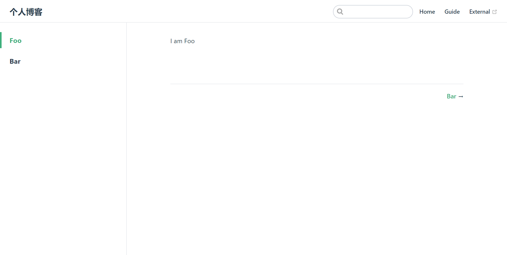
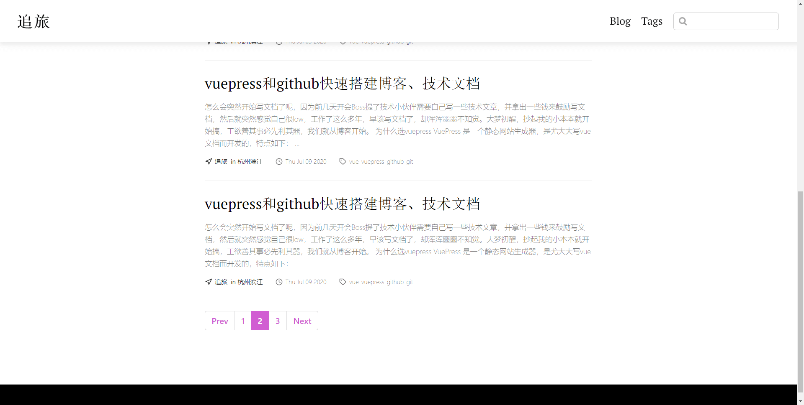
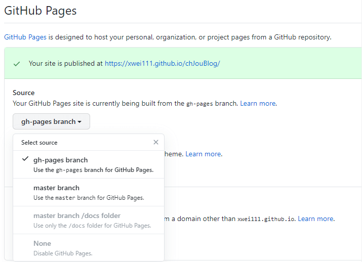

## 前言

怎么会突然开始写文档了呢，因为前几天开会Boss提了技术小伙伴需要自己写一些技术文章，并拿出一些钱来鼓励写文档，然后就突然感觉自己很low，工作了这么多年，早该写文档了，却浑浑噩噩不知觉。大梦初醒，抄起我的小本本就开始搞，工欲善其事必先利其器，我们就从博客开始。

## 为什么选vuepress

VuePress 是一个静态网站生成器，是尤大大写vue文档而开发的，特点如下：

* 快速搭建
* 配置少、性能高
* 默认主题及自定义主题，可发挥程度高
* markdown拓展
* 自带 pwa

vue又是我比较喜欢的前端框架，所以vuepress是首选，接下来我们将开始搭建。

## 开始搭建

### 准备工作

我们将用yarn来演示，所以先来一点准备工作，安装[node.js](https://nodejs.org/en/)，安装yarn
```js
npm install yarn -g
```

ok，有了node和yarn后我们就可以开开心心的玩耍了。假如你只是想尝试玩一下的话，右边链接 [vuepress快速上手](https://www.vuepress.cn/guide/getting-started.html) 。

### 新建并进入一个文件夹

```js
mkdir myDocs

cd myDocs
```

### 初始化项目
```js
npm init
```
这个过程会让你填写一个项目信息，如果你不想填无脑回车就好

### 安装vuepress
```js
yarn add vuepress -D
```
安装完毕后myDocs下多了node_modules和yarn.lock，这些文件在我们提交的时候是不需要提交的(特别是node_modules)，新建.gitignore,将后续可能会产生的不需要提交的文件加进去，如下(根据实际项目配置)
```js
/node_modules
/npm-debug.log*
/yarn-error.log
/yarn.lock
/package-lock.json
```
### 目录结构

```js
.
├── docs
│   ├── .vuepress (可选，用于存放全局的配置、组件、静态资源等)
│   │   ├── components (可选，该目录中的 Vue 组件将会被自动注册为全局组件)
│   │   ├── theme (可选，用于存放本地主题)
│   │   │   └── Layout.vue
│   │   ├── public (可选，静态资源目录)
│   │   ├── styles (可选，用于存放样式相关的文件)
│   │   │   ├── index.styl (可选，将会被自动应用的全局样式文件)
│   │   │   └── palette.styl(可选，用于重写默认颜色常量，或者设置新的 stylus 颜色常量)
│   │   ├── templates (可选，存储 HTML 模板文件)
│   │   │   ├── dev.html
│   │   │   └── ssr.html
│   │   ├── config.js (可选，配置文件的入口文件)
│   │   └── enhanceApp.js (可选，客户端应用的增强)
│   │ 
│   ├── README.md
│   ├── guide
│   │   └── README.md
│   └── config.md
│ 
└── package.json
```

这是官方的目录结构，为了方便管理，项目看起来更整洁，所有的配置以及md文档都放在了docs下，很多是可选的，如果不涉及自定义主题很多文件我们是不需要的，我们只需要config.js配置文件和README.md即可，生成目录如下

```js
myDocs
├── .gitignore
├── docs
│   ├── .vuepress
│   │   └── config.js
│   └── README.md
├── package.json
└── yarn.lock

```
### 配置config.js

```js
module.exports = {
    title: '个人博客',
    description: '分享笔记，技术博客',
}
```
具体配置见 [vuepress配置](https://www.vuepress.cn/config/)

### 初步完成

ok，我们的博客已经初步搭建完毕，在package.json中加入命令
```js
"scripts": {
    "start": "npm run dev",
    "dev": "vuepress dev docs",
    "build": "vuepress build docs"
}
```
在README中贴一些散文然后执行```yarn start```看看效果吧


GOOD!!! 终于有了自己的博客了。

宝贝儿，真正的战斗才刚刚打响！！！！

## 进一步完善

我们已经初步完成一个博客，但是我们可能有很多文章要写，肯定不会每次都搭个博客，这时我们就需要认真的看一下[vuepress配置](https://www.vuepress.cn/config/)

### 配置首页

通过配置文档我们可以知道，我们可以使用vuepress默认主题，配置首页，导航栏等等一系列操作，ok我们先配置首页，开启```ctrl+c```  ```ctrl+v```大法，在README.md加入

```js
---
home: true
heroImage: /mine.jpg
heroText: 我的博客
tagline: 博客副标题
actionText: 查看 →
actionLink: /foo
features:
- title: 简洁至上
  details: 以 Markdown 为中心的项目结构，以最少的配置帮助你专注于写作。
- title: Vue驱动
  details: 享受 Vue + webpack 的开发体验
- title: 高性能
  details: VuePress 为每个页面预渲染生成静态的 HTML
footer: MIT Licensed | Copyright © 2018-present Evan You
---
```
### 添加文章
在public中加入mine.jpg图片，创建bar.md和foo.md

```js
myDocs
├── .gitignore
├── docs
│   ├── .vuepress
│   │   ├── config.js
│   │   └── public
│   │       └── mine.jpg
│   ├── bar.md
│   ├── foo.md
│   └── README.md
├── package.json
└── yarn.lock

```

### 配置config.js

```js
module.exports = {
    title: '个人博客',
    description: '分享笔记，技术博客',
    themeConfig: {
        nav: [
            { text: 'Home', link: '/' },
            { text: 'Guide', link: '/guide/' },
            { text: 'External', link: 'https://google.com' },
        ],
        sidebar: [
            { title: 'Foo', path: '/foo' },
            { title: 'Bar', path: '/bar' }
        ]
    }
}
```
### 大功告成

ok，```yarn start``` 看看效果




哎呦，不错哦！！！


现在看起来似乎有模有样了！但是有人说了，这个看起来默认主题看起来一点逼格也没有，完全配不上我的帅气，小姐姐看到这个都再也不想理我了。ok满足你！！！

## 主题

终于到主题了，vuepress默认主题似乎更适合写一些开发文档，对于个人博客来讲过于板正。但vuepress完全可以满足你的任何意淫，```自定义主题```，这也是我超喜欢vuepress的原因之一，给你最大的发挥空间。

平时工作那么忙哪有时间来开发主题啊，小哥哥，我可以要嗟来之食吗? ok，No Problem！！！

### More Theme 

* First Blood   

vuepress亲情推荐博客主题：[@vuepress/theme-blog](https://vuepress-theme-blog.ulivz.com/)，本博客就是使用该主题

* Double Kill

极简：[vuepress-theme-reco](https://github.com/vuepress-reco/vuepress-theme-reco)、[deom](https://www.recoluan.com/)

* Triple Kill

文档主题：[vuepress-theme-bulma](https://github.com/nakorndev/vuepress-theme-bulma) 、[demo](https://vuepress-theme-bulma.nakorn.dev/)

* Quadra kill 

简洁风：[vuepress-theme-api](https://github.com/sqrthree/vuepress-theme-api) 、[demo](https://blog.sqrtthree.com/vuepress-theme-api/)

* Penta kill

个性：[vuepress-theme-indigo-material](https://github.com/zhhlwd/vuepress-theme-indigo-material)、[demo](https://zhhlwd.gitee.io/)

* Ace

All: [github-vuepress-theme](https://github.com/search?q=vuepress-theme)

老铁们，总有一款你喜欢的，如果你是处女座不要找了，相信我你只有一条路可走：[开发主题](https://www.vuepress.cn/theme/writing-a-theme.html)

### 使用主题

我们以[@vuepress/theme-blog](https://vuepress-theme-blog.ulivz.com/)为例子，以本博客为demo大概讲一下使用方法

安装

```js
yarn add @vuepress/theme-blog -D
```

config.js

```js
module.exports = {
    title: '追旅',
    description: '分享笔记，技术博客',
    theme: '@vuepress/blog'
}
```

接着我们按照[@vuepress/theme-blog](https://vuepress-theme-blog.ulivz.com/)规则新建一个文件，如下

```js
.
├── .gitignore
├── blog
│   ├── .vuepress
│   │   ├── config.js
│   │   └── public
│   └── _posts
│       └── 2020-07-09-vuepress-and-github.md 建议按照日期加帖子名称命名
├── package.json
├── README.md
└── yarn.lock
```

配置好你的```package.json```，在2020-07-09-vuepress-and-github.md 添加

```js
---
title: vuepress和github快速搭建博客、技术文档  (标题)
date: 2020-07-09 (日期)
tags:  (标签)
  - vue
  - vuepress
  - github
  - git
author: 追旅 (作者)
location: 杭州滨江 (位置)
---
```

```yarn start``` 看效果


当文章多的时候，无需担心，自动分页，如下



当然你也可以选择手动配置分页、标签、页脚和头部导航等，这里就不一一赘述了。

### 评论

如果你想各位看官们能够和你探讨问题，评论功能就必不可少了。我们先来看看评论功能长什么样子吧。


红色框框里的内容就是我们的评论功能了，涉及到github  OAuth 授权，然后回跳回来，就可以评论了，评论内容可以实时同步到github的issues，就是这么神奇！！！我想你一定很想知道这里的来龙去脉，去吧皮卡丘[GitHub OAuth 第三方登录示例教程](http://www.ruanyifeng.com/blog/2019/04/github-oauth.html)

ok，我们先说一下大概流程

首先，配置config.js，更多了解[vssue](https://vssue.js.org/guide/vuepress.html#usage)、[disqus](https://vuepress-plugin-disqus.netlify.app/#usage)，我们选择vssue，disqus要先注册，需要翻墙

```js
module.exports = {
    title: '追旅',
    description: '分享笔记，技术博客',
    theme: '@vuepress/blog',
    themeConfig: {
        comment: {
            service: 'vssue', // 有两种disqus和vssue， 我们选择vssue
            owner: github用户名,
            repo: 仓库名,
            clientId: 客户端 ID,
            clientSecret: 客户端密钥,
        },
    },
}
```

然后，需要在.vuepress中添加layouts/Post.vue添加如下代码

```js
<template>
  <div>
      <Content />
      <Comment />
  </div>
</template>

<script>
import { Comment } from '@vuepress/plugin-blog/lib/client/components'

export default {
  components: {
    Comment,
  },
}
</script>
```

完成这两步之后我们就需要去获取```owner```、```repo```、```clientId```、```clientSecret```

```owner```、```repo```我们就不在多说了，就是你github用户名和你建的仓库名称

关键是我们如何获取```clientId```和```clientSecret```

第一步，在 GitHub 打开配置Settings，打开Developer settings，选择oAuth Apps

第二步，点击New Oauth App去注册 OAuth 应用，Homepage URL 和Authorization callback URL就是你页面地址和回调地址，例如本地：http://localhost:8000

第三步，注册完成后打开你注册的oAuth Apps 就可以看到你的```clientId```和```clientSecret```

如果还有疑问可以参考[带图步骤](https://www.jianshu.com/p/5a00f252a5c1)，这一切的前提是你要先注册好github

拿到并配置好```clientId```和```clientSecret```就可以尝试一下评论，评论完成后到github的issues就能够看到评论了，是不是感觉离人生目标更进了一步呢，顺便说一句国内网络对国外的网站不是甚友好，登录github等不上去多尝试几次，快崩溃的时候也不要急，你可以尝试翻墙软件

### More

我们还能做的更多吗，答案是肯定的，```@vuepress/theme-blog```还提供了newsletter功能，类似订阅功能，用到了[VuePress-plugin-Mailchimp](https://vuepress-plugin-mailchimp.billyyyyy3320.com/#install),需要用到[Mailchimp](https://mailchimp.com/)注册账号，对你的网络又是一个考验，本人试了好久只成功了一次，所以本博客不在做这样的功能了，感兴趣的可以尝试一下，有疑问评论区见:grinning: :grinning: :grinning:

最后打开[PWA](https://developer.mozilla.org/zh-CN/docs/Web/Progressive_web_apps)，提升博客的性能

## 部署

啰啰嗦嗦说了一大堆，终于可以开始部署了。vuepress提供了很多[部署](https://www.vuepress.cn/guide/deploy.html#github-pages)方式，我们使用github pages静态页部署，这也是博客比较常用的一种方式

### github pages

github pages在哪里呢?在你的github上新建一个仓库，点击配置settings就可以看到github pages，如下图



新建的项目这里默认的是None，点击打开下边是没有gh-pages branch，上图有是因为我已经创建了gh-pages分支，这里选择哪个分支就会访问哪个分支的资源，master branch/docs floder为disabled状态，是因为master分支上没有docs文件夹，如果有这个选项也是可以选择的，简单的项目选择master也是可以的，我们这里选择部署gh-pages分支。绿色区域的链接为我们静态页的访问地址。

### base

如果你打算发布到 ```https://<USERNAME>.github.io/```，则可以省略这一步，因为 base 默认即是 ```"/"```

如果你打算发布到 ```https://<USERNAME>.github.io/<REPO>/```（也就是说你的仓库在 ```https://github.com/<USERNAME>/<REPO>```），则将 base 设置为 ```"/<REPO>/"```

按照官方文档的描述，我们需要在config.js中添加如下配置
```js
base: '/chJouBlog/'
```

### github actions

配置完```base```我们就到了部署环节了，究竟要怎么部署呢，这个时候github actions 就起到了关键的作用，actions是github 2019年11月正式推出的CI/CD服务，github将持续集成中的抓取代码、运行测试、登录远程服务器等操作称之为actions，github actions最大的特点就是你不需要却写某个复杂的脚本，直接引用其它开发者写好的action就可以了。

GitHub Actins基本术语：

* workflow （工作流程）：持续集成一次运行的过程，就是一个 workflow。
* job （任务）：一个 workflow 由一个或多个 jobs 构成，含义是一次持续集成的运行，可以完成多个任务。
* step（步骤）：每个 job 由多个 step 构成，一步步完成。
* action （动作）：每个 step 可以依次执行一个或多个命令（action）。

基本配置

```js
.github/workflow/文件名.yml
这是基础模板
这个 workflow 的名字，可以随意命名
name: Node.js CI

on触发条件
on: [push]
1.push事件触发workflow 
2.如果多个事件（on: [push,pull]）
3.指定触发事件，可以限定分支、tag、指定文件路径（on.<push|pull_request>.<tags|branches|paths>）
 在master分支push时触发
  push：
    branches:
      - master
    tags:
      - v1.0.0 指定tags版本更新
      - v1.*.*  tags版本为1.n.n都会更新
   paths:
      - '**.js' 所有的js文件更新时提交触发
      - 'doc/**'  doc下文件发生改动触发
4.忽略分支、tag、某一文件    branches-ignore、tags-ignore  、paths-ignore
   branches-ignore:
     - dev 提交时分支为dev 不触发
   tags-ignore:
     - v2   ag为v2时不触发
5. 计划的工作流在默认或基本分支上的最新提交上运行。可以运行计划的工作流程的最短间隔是每5分钟一次
  schedule:
     - cron:  '*/5 * * * *' 
    * * * * * (minute (0 - 59)、hour (0 - 23)、day of the month (1 - 31)、month (1 - 12 or JAN-DEC)、day of the week (0 - 6 or SUN-SAT))
  *   任何值               * * * * * 每天每一分钟运行。
  ， 值列表分隔符      2,10 4,5 * * * 在每天的第4和5小时的第2分钟和第10分钟运行。
  --  取值范围              0 4-6 * * * 在第4、5和6小时的第0分钟运行。
  /   步长值               20/15 * * * * 从20分钟到59（每20、35和50分钟）开始，每15分钟运行一次。

jobs: 
所有的 job 都是并行的，但往往会有依赖关系
test:
link: 
  needs: test link依赖test
一个名为 build 的 job 
  build:
    runs-on指定运行所需要的虚拟机环境，必填
    ubuntu-latest指定Ubuntu GitHub托管的运行程序的最新版本。
    也可以自己定义托管环境[self-hosted, linux, ARM32]
    runs-on: ubuntu-latest

    strategy:
      matrix:
        node-version: [8.x, 10.x, 12.x]

    steps:
    获取源码
      - name: Checkout
        uses: actions/checkout@master 获取master代码
        with:
          persist-credentials: false
      - name: Install and Build
        run: | 行多个命令
          npm install
          npm run build
      - name: Deploy
        uses: JamesIves/github-pages-deploy-action@releases/v3 写好的action
        with:
          ACCESS_TOKEN: ${{ secrets.DEPLOY_KEY }} 定义生成key 生成步骤在下面
          BRANCH: gh-pages #操作应部署到的分支。
          FOLDER: dist #操作应部署的文件夹。
```

如果你还想了解更多关于GitHub Actions，请前往[GitHub Actions 入门教程](http://www.ruanyifeng.com/blog/2019/09/getting-started-with-github-actions.html)、[什么是GitHub Actions](https://www.cnblogs.com/babycomeon/p/12771624.html)、[GitHub Actions](https://docs.github.com/en/actions)

我们有两种方式配置actions

* 通过github上的Actions选项直接配置，在github上配置完会直接commit一次，所以我们必须pull一次代码
* 在本地工程里边新建.github\workflows\main.yml

我们选择在本地配置main.yml
```js
name: Publish page

on:
  push:
    branches:
      - master

jobs:
  build-and-deploy:
    runs-on: ubuntu-latest
    steps:
      - name: Checkout
        uses: actions/checkout@v2 
        with:
          persist-credentials: false

      - name: Install and Build 
        run: |
          npm install
          npm run build
      - name: Deploy 
        uses: JamesIves/github-pages-deploy-action@releases/v3
        with:
          GITHUB_TOKEN: ${{ secrets.GITHUB_TOKEN }}
          BRANCH: gh-pages
          FOLDER: blog/.vuepress/dist

```

ok配置完成后，开始提交代码
```js
git init
git add README.md
git commit -m "first commit"
git remote add origin https://github.com/<USERNAME>/<REPO>.git
git push -u origin master
```

提交后打开github actions


这里会有提交的状态，你可以实时查看，如果提交成功会打钩，失败会打叉，你可以查看哪个步骤出了问题，出了什么问题

如果部署完成，我们回到github pages配置那里，如果显示了绿色的框框，并且有提示```Your site is published at https://xxxx/```，访问```https://xxxx/```即可访问到你的博客

实际操作中，第一次部署的时候即使github actions显示ok，我们也需要等待访问一会才能看到我们的博客，本地建我们的workflows时，建议提交后在github pages那里重新选择一下gh-pages，然后耐心等待！！

兽人永不为奴！！！

Good Luck！！！


