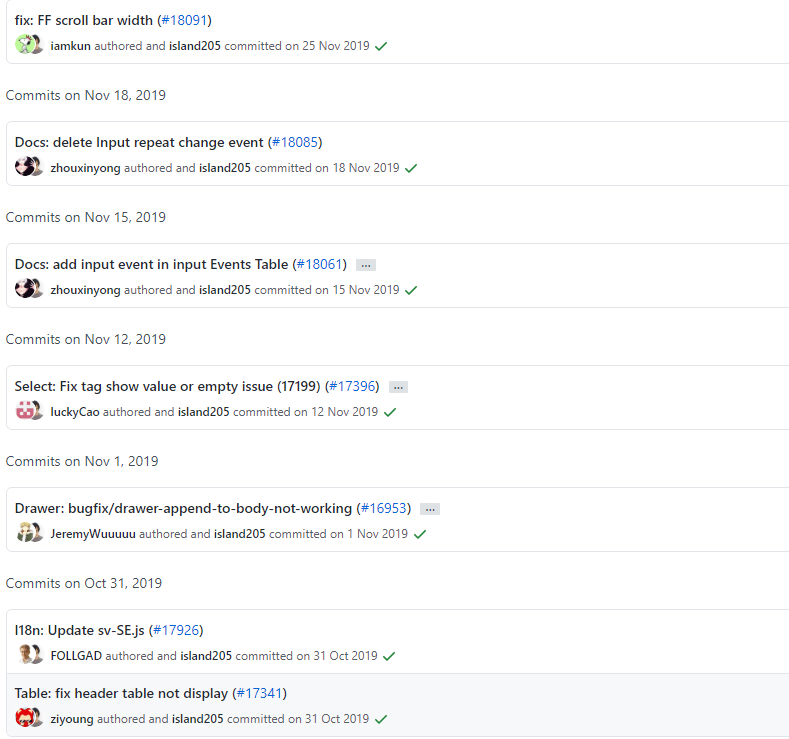
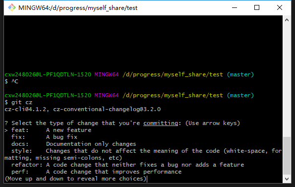
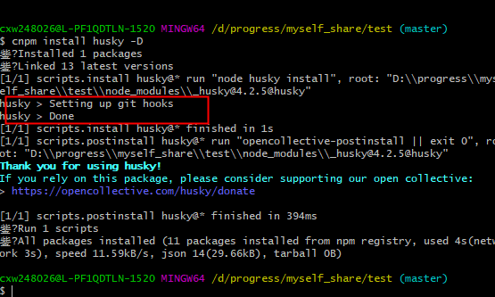
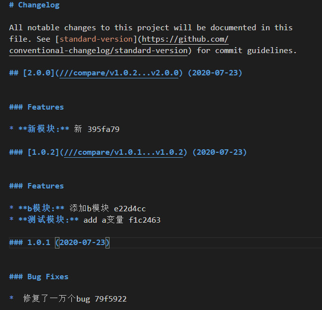

## 前言

日常工作多人协作项目非常常见，多人协作也就意味着我们需要一定的规范，众所周知eslint、tslint、stylelint、prettier等工具来帮助团队统一代码层面规范，同时提交代码也需要有一定的规范，这也是前端工程化进程中不可或缺的

下图是element的日常commit，可以看到commit的格式为key: value 形式的，key是功能模块，value则是对具体改动的描述，这样是不是能够比较清晰的描述每次commit



好的commit规范可以提供清晰的改动模块、信息、日志，目前业界比较认可[Angular规范](https://github.com/angular/angular/blob/master/CONTRIBUTING.md#commit)的，我们先来间了解一下

## 规范

一个commit messgae分为三部分：Header、Body、Footer，其中Header是必填的

* Header

Header中包含type、scope、subject

type类型，除了以下类型你也可以根据自己的项目自定义类型

|     type    |      描述    |
|-------------|--------------|
|     feat        |    新功能    |
|     fix         |    修复bug    |
|     refactor    |    代码重构    |
|     docs        |    文档    |
|     style       |    样式    |   
|     test        |    测试代码    |
|     chore       |    其他修改   |
|     pref        |    优化    |
|     build       |    构建依赖包改动    |
|     ci          |    CI修改    |

scope： 此次commit影响范围或涉及模块（例： package.json）

subject： 此次改动的描述

* Body

Body是对此次改动的详细描述

* Footer

Footer是一些备注, 通常是 BREAKING CHANGE 或修复的 bug 的链接

## Commitizen

Commitizen是一个 Commit message 的工具，可以很好的帮助我们

安装

```
npm install Commitizen -g
```

安装完成后进入项目执行（node项目 ）

```
commitizen init cz-conventional-changelog --save --save-exact
```

安装完毕之后，我们之后git commit操作就要用git cz来代替，当然你可以继续使用git commit，至于如何避免git commit提交的信息不规范我们稍后再讨论，先来看一下git cz命令，如下：



这一步标识让我们选择我们此次commit的类型，我们选择相应类型回车即可，之后会有如下各步骤：

```
# 填写此次的改动影响范围，继续
What is the scope of this change (e.g. component or file name): (press enter t
o skip)

```

```
# 写一个简短的描述，继续
 Write a short, imperative tense description of the change (max 88 chars)
```

```
# 做个详细描述，继续
Provide a longer description of the change
```

```
# 是否是BREAKING CHANGE，没有回车即可
Are there any breaking changes
```


```
# 是否关联已开启的问题，没有回车
Does this change affect any open issues
```

ok到此我们已经完成一个标准的commit，git log看一下：

```
Author: sf_cxw <17681828640@163.com>
Date:   Thu Jul 23 12:06:32 2020 +0800

    feat(用户管理): 添加黑白名单

    为了控各个用户权限

```

## commit校验

回到刚刚提到的git commit使用不规范的问题，我们需要在commit message时加入检验

安装@commitlint/cli、@commitlint/config-conventional(检验规则)

```
npm|cnpm install @commitlint/config-conventional @commitlint/cli -D
```

生成commitlint.config.js，也可选择在commitlint.config.js中自行配置，[配置](https://www.npmjs.com/package/@commitlint/config-conventional)

```
echo "module.exports = {extends: ['@commitlint/config-conventional']}" > commitlint.config.js
```

### husky

如何触发校验呢？？？这里我们需要了解一下```Git hooks```，```Git Hooks``` 就是那些在Git执行特定事件（如commit、push等）后执行前触发运行的脚本，当我们执行```git init```操作时.git/hooks目录下回默认生成一些挂钩，.sample 拓展名防止它们默认被执行。我们提交代码时的eslint、stylelint检验其实也是这个道理。

在这里我们使用[husky](https://www.npmjs.com/package/husky)来帮助我们完成校验工作，[husky](https://www.npmjs.com/package/husky)安装的过程中会在.git/hooks目录中生成一些我们需要的钩子。

安装

```
npm|cnpm install husky -D
```



如上图所示表示安装成功（一定要看清楚自己是否安装成功，博主吃过亏:cry: :cry: :cry:）

安装完成后在package.json中加入

```
"husky": {
    "hooks": {
      "pre-commit": "lint-staged", // 此处是你的eslint、stylelint等校验，没有无需配置
      "commit-msg": "commitlint -E HUSKY_GIT_PARAMS"
    }
  }
```

到此commit校验也已经配置完毕，看一下执行效果

```
$ git commit -m '1'
husky > commit-msg (node v10.16.0)
猝?  input: 1
鉁?  subject may not be empty [subject-empty]
鉁?  type may not be empty [type-empty]

鉁?  found 2 problems, 0 warnings
鈸?  Get help: https://github.com/conventional-changelog/commitlint/#what-is-commitlint

husky > commit-msg hook failed (add --no-verify to bypass)

```

我们发现现在不按着规范来已经不能正常commit代码了，如果你执意要用commit的话，按照规范提交代码就能够通过，不过还是建议大家选择```git cz```

```
$ git commit -m 'fix:  修复了一万个bug'
husky > commit-msg (node v10.16.0)
[master (root-commit) 79f5922] fix:  淇浜嗕竴涓囦釜bug
 4 files changed, 2001 insertions(+)
 create mode 100644 .gitignore
 create mode 100644 commitlint.config.js
 create mode 100644 package-lock.json
 create mode 100644 package.json
```

## 日志及版本

上文提到了好的commit规范还能够为我们提供不错的日志，[conventional-changelog](https://github.com/conventional-changelog/conventional-changelog)，就可以便可以给我们提供日志，但是我们有更好的选择：[standard-version](https://www.npmjs.com/package/standard-version)

[standard-version](https://www.npmjs.com/package/standard-version)除了帮助我们生产日志外，还可以协助我们控制项目版本及为git打tag

全局安装
```
npm|cnpm install standard-version -g
```

```package.json```中加入

```
"scripts": {
    "release": "standard-version --release-as",
    "release:100": "npm run release -- major",
    "release:010": "npm run release -- minor",
    "release:001": "npm run release -- patch"
}
```

* major：主版本
* minor：次版本
* patch：修订版
* release：自定义版本npm run release -- 1.0.0
* release:100：执行该脚本, 那么如果当前版本是 1.0.0 那么版本将被提升至 2.0.0
* release:010: 执行该脚本, 那么如果当前版本是 1.0.0 那么版本将被提升至 1.1.0
* release:001: 执行该脚本, 那么如果当前版本是 1.0.0 那么版本将被提升至 1.0.1


执行上述命令时，会打上版本tag和日志，日志存放于```CHANGELOG.md```中，具体如下

```
$ git tag
v1.0.1
v1.0.2
v2.0.0
```




日志实际效果见[追旅博客日志](/chJouBlog/log)


## 结语

学海真滴无涯 :joy: :joy:


