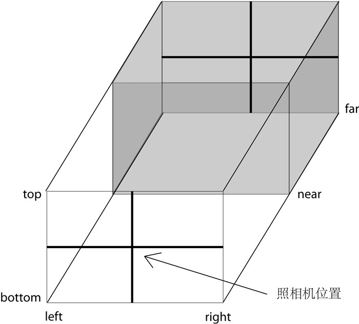

## 前言

记得自己做前端是看到了很酷的特效，感觉热血沸腾，一下子就冲到前端的队伍中去，实际工作中确实各种后台管理、H5(涉及一些动画)，然后就是一些大屏，技术倒是用的也不少，从最开始的JQ(好几年没用过了)到vue、react再到支付宝微信小程序(包括uni-app)基本都是在2D的世界里徘徊，对3D世界充满向往，奈何自己没文化，一声叹气撸代码！

最近还是决定来学一下3D，想了想从WebGL和计算机图形学入手周期较长，先去了解一下threejs，在回过头来学习。做个学习小笔记

## 三要素

* 渲染器(renderer)

渲染器应该类似于视网膜（猜的），决定了我们渲染到页面的方式和效果，threejs提供了很多渲染器，CanvasRenderer、WebGLRenderer等，WebGLRenderer渲染性能及渲染效果好于CanvasRenderer，兼容性上要劣于CanvasRenderer。

* 场景(scene)

场景就是大千世界，承载着所要展示的物体、光源等，相当于一个容器

* 相机(camera)

相机相当于人的眼睛，从不同角度看到的物体也是不相同的。常用的相机有正交（orthographic）相机和透视（perspective）相机

三要素是缺一不可的，我们之后对3D的探索也都是围绕着这三要素展开的，开始探索的3D世界吧！！！

## 相机

相机这部分还是需要单独拎出来研究一下的，3D的很多效果都是操作相机实现的。

### 正交相机(OrthographicCamera)

[demo](https://chasejourney.top/three_demo/index-1.html)
[代码](https://github.com/xwei111/three_demo/blob/master/index-1.html)



```js
THREE.OrthographicCamera(left, right, top, bottom, near, far)
```

正交相机是由左、右、上、下、远、近六个面组成，正交相机不会随着距离的改变改变物体的大小，使用正交相机的时候为了保证渲染结果的比例正常需要保证(right-left) / (top - bottom)等于canvas宽 / 高

|       参数      |     说明     |
|-----------------|----------------|
|      left       |   左面位置     |
|      right      |   右面位置     |
|      top        |   左面位置     |
|      bottom     |   左面位置     |
|      near       |   左面位置     |
|      far        |   左面位置     |

### 透视相机(PerspectiveCamera)

[demo](https://chasejourney.top/three_demo/index-2.html)
[代码](https://github.com/xwei111/three_demo/blob/master/index-2.html)


```js
THREE.PerspectiveCamera(fov, aspect, near, far)
```

透视相机更像人的眼睛，离相机越远物体越小，相机可以通过```camera.position.set```和 ```camera5.lookAt```来设置相机的位置和观察的位置

|        参数     |     说明     |
|-----------------|----------------|
|      fov        |   视野角度     |
|      aspect     |   渲染区域的纵横比     |
|      near       |   最近距镜头的位置     |
|      far        |   最远距镜头的位置     |

## 几何体

[demo](https://chasejourney.top/three_demo/index-3.html)
[代码](https://github.com/xwei111/three_demo/blob/master/index-3.html)

### 长方形

```js
new THREE.PlaneGeometry(width, height, widthSegments, heightSegments );
```

|     参数    |     说明     |
|---------------|----------------|
|      width     |   x轴长度     |
|      height    |   y轴长度     |
| widthSegments  |   x轴分段数   |
| heightSegments |   y轴分段数   |

### 长方体

```js
THREE.CubeGeometry(width, height, depth, widthSegments, heightSegments, depthSegments)
```

|     参数    |     说明     |
|---------------|----------------|
|      width              |   x轴长度     |
|      height             |  y轴长度     |
|      depth              |  z轴长度     |
|      widthSegments      |  x轴分段     |
|      heightSegments     |  y轴分段     |
|      depthSegments      |  z轴分段     |

### 圆

```js
THREE.CircleGeometry(radius, segments, thetaStart, thetaLength)
```

|     参数    |     说明     |
|---------------|----------------|
|      radius            |   半径     |
|      segments          |  分段数     |
|      thetaStart        |  开始的弧度     |
|      thetaLength       |  跨过的弧度     |

### 球体

```js
THREE.SphereGeometry(radius, segmentsWidth, segmentsHeight, phiStart, phiLength, thetaStart, thetaLength)
```

|     参数    |     说明     |
|---------------|----------------|
|      radius             |   半径     |
|      segmentsWidth      |  经度上的切片数     |
|      segmentsHeight     |  纬度上的切片数     |
|      phiStart           |  经度开始的弧度     |
|      phiLength          |  经度跨过的弧度     |
|      thetaStart         |  纬度开始的弧度     |
|      thetaLength        |  纬度跨过的弧度     |

### 圆柱体

```js
THREE.CylinderGeometry(radiusTop, radiusBottom, height, radiusSegments, heightSegments, openEnded)
```

|     参数    |     说明     |
|---------------|----------------|
|      radiusTop         |  顶圆半径     |
|      radiusBottom      |  底圆半径     |
|      height            |  高度         |
|      radiusSegments    |  上下圆截面分段     |
|      heightSegments    |  圆柱体竖直方向上分段     |
|      openEnded         |  Boolean值，是否有顶面和底面，默认为true即有     |

### 正四面体

```js
THREE.TetrahedronGeometry(radius, detail)
```

|     参数    |     说明     |
|---------------|----------------|
|      radius         |  半径     |
|      detail         |  细节层次     |

### 圆环面

```js
THREE.TorusGeometry(radius, tube, radialSegments, tubularSegments, arc)
```

|     参数    |     说明     |
|---------------|----------------|
|      radius                 |  圆环半径     |
|      tube                   |  管道半径     |
|      radialSegments         |  圆环分段     |
|      tubularSegments        |  管道分段     |
|      arc                    |  圆环弧度     |

### 圆环结

```js
THREE.TorusKnotGeometry(radius, tube, radialSegments, tubularSegments, p, q, heightScale)
```

|     参数    |     说明     |
|---------------|----------------|
|      radius                 |  圆环半径     |
|      tube                   |  管道半径     |
|      radialSegments         |  圆环分段     |
|      tubularSegments        |  管道分段     |
|      p                      |  整个圆环围着圆心绕了多少圈     |
|      q                      |  整个圆环的内部扭了多少个结     |
|      heightScale            |  z轴缩放      |


### 自定义形状

除了threejs提供的形状外，还可以自定义形状，自定义形状需要定义每一个顶点，对于复杂的图形可以导入模型，提供的demo有涉及到一些新的api，自行参考

## 材质

材质和灯光无法分割开来，所以我们放在一块学习

[demo](https://chasejourney.top/three_demo/index-4.html)
[代码](https://github.com/xwei111/three_demo/blob/master/index-4.html)

### 基本材质

```js
THREE.MeshBasicMaterial(options)
```

基本材质不会反光、不会产生阴影，不指定颜色时随机颜色，options常用属性如下：

|     参数    |     说明     |
|---------------|----------------|
|      visible            |  是否可见，默认为true     |
|      side               |  渲染面片正面或是反面，默认为正面THREE.FrontSide，可设置为反面THREE.BackSide，或双面THREE.DoubleSide     |
|      wireframe          |  是否渲染线而非面     |
|      color              |  颜色     |
|      map                |  纹理     |

### Lambert材质

```js
THREE.MeshLambertMaterial(options)
```

Lambert光照模型的主要特点是只考虑漫反射而不考虑镜面反射的效果，因而对于金属、镜子等需要镜面反射效果的物体就不适应，对于其他大部分物体的漫反射效果都是适用的

|     参数    |     说明     |
|---------------|----------------|
|      color            |  颜色    |
|      ambient          |  环境光（AmbientLight）反射颜色     |
|      emissive         |  自发光颜色     |

### Phong材质

```js
THREE.MeshPhongMaterial(options)
```

Phong材质除了Lambert材质特点还考虑了镜面反射的效果，因此对于金属、镜面的表现尤为适合

|     参数    |     说明     |
|---------------|----------------|
|      color            |  颜色    |
|      ambient          |  环境光（AmbientLight）反射颜色     |
|      emissive         |  自发光颜色     |
|      specular         |  镜面反射系数     |
|      shininess        |  光斑大小     |

### 法向材质

```js
THREE.MeshNormalMaterial()
```

法向材质不需要设置参数，适合调试

### 纹理

```js
const texture = THREE.ImageUtils.loadTexture('./test.png')

THREE.MeshLambertMaterial({ map: texture });
```

## 光

[demo](https://chasejourney.top/three_demo/index-4.html)
[代码](https://github.com/xwei111/three_demo/blob/master/index-4.html)

### 环境光

```js
THREE.AmbientLight(color)
```

环境光只需要指定颜色

### 点光源

```js
THREE.PointLight(color, intensity, distance)
```

|     参数    |     说明     |
|---------------|----------------|
|      color            |  颜色    |
|      intensity        |  亮度     |
|      distance         |  最远距离     |

### 平行光

```js
THREE.DirectionalLight(color, intensity)
```

|     参数    |     说明     |
|---------------|----------------|
|      color            |  颜色    |
|      intensity        |  亮度     |


### 聚光灯

```js
THREE.SpotLight(color, intensity, distance, angle, exponent);
```

|     参数    |     说明     |
|---------------|----------------|
|      color            |  颜色    |
|      intensity        |  亮度     |
|      distance         |  最远距离     |
|      angle            |  灯光角度，默认Math.PI / 3，最大Math.PI / 2     |
|      exponent         |  光强在偏离target的衰减指数，默认10     |

## 阴影

[demo](https://chasejourney.top/three_demo/index-5.html)
[代码](https://github.com/xwei111/three_demo/blob/master/index-5.html)

* 接收阴影材质(产生阴影的材质)需要是```LambertMaterial```或者```PhongMaterial```
* 产生阴影的灯光可以为```PointLight```、```DirectionalLight```、```SpotLight```

除了上述灯光和材质，还需要做一下配置

* 渲染器

```js
renderer.shadowMap.enabled = true;
```

* 灯光

```js
light.castShadow = true
```

* 产生阴影物体

```js
mesh.castShadow = true
```

* 接收阴影物体

```js
mesh.receiveShadow = true
```

设置好以上条件就可以看到产生的阴影了

## 字体 

[demo](https://chasejourney.top/three_demo/index-6.html)
[代码](https://github.com/xwei111/three_demo/blob/master/index-6.html)

```js
THREE.TextGeometry(text, parameters)
```

|     参数    |     说明     |
|---------------|----------------|
|    size             |  字号    |
|    height           |  文字厚度     |
|    curveSegments    |  弧线分段数，使得文字的曲线更加光滑  |
|    font             |  字体  |
|    bevelEnabled     |  布尔值，是否开启斜角  |
|    bevelThickness   |  文本上斜角的深度  |
|    bevelSize        |  斜角与原始文本轮廓之间的延伸距离  |
|    bevelSegments    |  斜角的分段数  |


可以到[文字](https://github.com/mrdoob/three.js/tree/master/examples/fonts)下载自己需要的字体，文字像图片一样需要加载，如下

```js
const loader = new THREE.FontLoader();

loader.load('./assets/fonts/gentilis_bold.typeface.json', function (font) {
    mesh = new THREE.Mesh(
      new THREE.TextGeometry('Journey', { font: font, size: 0.7 }), 
      material
    );
    scene.add(mesh);
    renderer.render(scene, camera);
});
```

## 外部模型

对于一些复杂的几何体如果自己去画的话成本相当的高，所以引入外部模型会是一个非常好的选择

