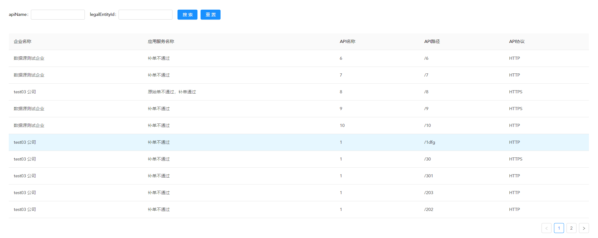

## 前言

vue3.0虽然还没有正式发布，但[@vue/composition-api](https://composition-api.vuejs.org/zh/#%E6%A6%82%E8%BF%B0)已经提供了vue3.0的一些api让我们可以提前了解vue3.0的内容，看完之后感觉vue越来越灵活了，将会有一大波```use```工具代码涌现出来，逻辑层将会是组合式API的天下(话说hooks也是这样的模式)，哈哈哈！！！

## 优点

组合式API的优点：

* 无需为复用逻辑创建实例
* 不存在命名冲突
* api来源明确(如： useTable、useForm、useModal)
* 组合式API依赖传入的参数和Vue全局API，而非上下文
* 最重要的是可以节省大量的时间

## 封装useTable

如果你不明白它的优势，一起封装一个```useTable```来加深理解，它至少会让你的工作时间缩短三分之二

### 需求分析



这是```table```表格，在后台系统是非常常见的一种结构，一般情况下它有以下功能:

* 初始化table
* 分页查询
* 条件查询
* 重置table

我们按照这样的功能点来封装一个```useTable```，UI库使用[ant-design-vue](https://www.antdv.com/docs/vue/introduce-cn/)，接口返回数据格式如下：

```js
{
  success: boolean,
  message: string,
	data: {
		total: number,
		list: Array<object>,
		current: number,
		pageSize: number
	}
}
```


### 初始化table

1. 首先table数据一般情况下是从后端接口拿到的，但静态页面开发的时候你也可能写一些静态JSON数据

2. 请求接口的时候除了```current```和```pageSize```也可能带有其他默认入参

3. 将分页数据、table数据返回

根据以上代码实现如下：

```ts
import { reactive, toRefs, ref } from "@vue/composition-api";

interface response_result {
	success: boolean;
	message: string;
	data: {
		totalItem: number;
		list: Array<{ [key: string]: any }>;
		current: number;
		pageSize: number;
	}
}

function useTable<P>(
  request?: (params?: Partial<P>) => Promise<response_result> | Array<{ [key: string]: any }>, 
  defaultParams?: Partial<P> = {}
): { [key: string]: any } {

	const state = reactive<{ [key: string]: any }>({
		params: Object.assign({ current: 1, pageSize: 10 }, defaultParams),
		dataSorce: [],
		pagination: { current: 1, pageSize: 10, total: 0 }
	})

	const _request = (params: Partial<P>) => {
    	// 静态数据
		if (Object.prototype.toString.call(request) == "[object Array]") {
			state.dataSorce = request
            state.pagination.total = request.length
		}
		if (Object.prototype.toString.call(request) == "[object Function]") {
           // { ...state.params, ...params } 将初始参数和后续查询参数合并
			request && (request({ ...state.params, ...params }) as Promise<any>).then((res: any) => {
				if (res.success) {
					const { data: { totalItem, list } } = res
					state.pagination.total = totalItem // 总条数
					state.dataSorce = list
				}
			})
		}
	}

	_request(state.params)

	return {
		...toRefs(state) // reactive解构后非响应，使用toRefs转化（这里为了省事将所有的state都返回了）
	}
}

export default useTable;
```

### 添加分页


```ant-design-vue```表格分页需要在```pagination```中添加```onChange```和```onShowSizeChange```

```ts

// 为了后续操作方便将分页信息提出来
const current = ref<number>(1);
const pageSize = ref<number>(10);

const state = reactive<{ [key: string]: any }>({
	params: Object.assign({ current, pageSize }, defaultParams),
	dataSorce: [],
	pagination: {
		current,
		pageSize,
		total: 0,
		onChange: (page: number, pageSize: number): void => pageChange(page, pageSize),
		onShowSizeChange: (current: number, size: number): void => showSizeChange(current, size)
	}
})
// 当前页更改事件
const pageChange = (page: number, pageSize: number) => {
	current.value = page;
	_request({})
}
// 当前页条数据更改事件
const showSizeChange = (current: number, size: number) => {
	pageSize.value = current;
	_request({})
}

```

### 搜索table

```ts
const state = reactive<{ [key: string]: any }>({
	searchInfo: {}
})
// 搜索事件
const searchHandle = (searchInfo: Partial<P>) => {
	current.value = 1;
	pageSize.value = 10;
	state.searchInfo = searchInfo; // 存储搜索条件
	_request(searchInfo)
}

```

### 重置table

```ts
const resetHandle = () => {
	// 重置分页和搜索条件
	state.searchInfo = {}
	current.value = 1;
	pageSize.value = 10;
	_request({})
}
```

### 完整代码

```ts
import { reactive, toRefs, ref } from "@vue/composition-api";

interface response_type {
	success: boolean;
	message: string;
	data: {
		totalItem: number;
		list: Array<{ [key: string]: any }>;
		current: number;
		pageSize: number;
	}
}

function useTable<P>(
	request: Array<{ [key: string]: any }>,
	defaultParams?: Partial<P>
): { [key: string]: any }

function useTable<P>(
	request: (params?: Partial<P>) => Promise<response_type>,
	defaultParams?: Partial<P>
): { [key: string]: any }

function useTable<P>(
	request: ((params?: Partial<P>) => Promise<response_type>) | Array<{ [key: string]: any }>,
	defaultParams?: Partial<P>
): { [key: string]: any } {

	const current = ref<number>(1);
	const pageSize = ref<number>(10);

	const state = reactive<{ [key: string]: any }>({
		params: Object.assign({ currentPage: current, pageSize: pageSize }, defaultParams),
		searchInfo: {},
		dataSorce: [],
		pagination: {
			current: current,
			pageSize: pageSize,
			total: 0,
			onChange: (page: number, pageSize: number): void => pageChange(page, pageSize),
			onShowSizeChange: (current: number, size: number): void => showSizeChange(current, size)
		}
	})

	const _request = (params: Partial<P>) => {
		if (Object.prototype.toString.call(request) == "[object Array]") {
			state.dataSorce = request
			state.pagination.total = request.length
		}
		if (Object.prototype.toString.call(request) == "[object Function]") {
			(request as Function)({ ...state.params, ...params }).then((res: any) => {
				if (res.success) {
					const { data: { totalItem, list } } = res
					state.pagination.total = totalItem ? totalItem : list.length
					state.dataSorce = list
				}
			})
		}
	}

	const searchHandle = (searchInfo: any) => {
		current.value = 1;
		pageSize.value = 10;
		if(searchInfo.currentPage) {
			state.pagination.current = searchInfo.currentPage
		}
		if(searchInfo.pageSize) {
			state.pagination.pageSize = searchInfo.pageSize
		}
		state.searchInfo = searchInfo;
		_request(searchInfo)
	}

	const pageChange = (page: number, pageSize: number) => {
		current.value = page;
		state.searchInfo.currentPage = page
		_request(state.searchInfo)
	}

	const showSizeChange = (current: number, size: number) => {
		pageSize.value = current;
		state.searchInfo.pageSize = current
		_request(state.searchInfo)
	}

	const resetHandle = () => {
		state.searchInfo = {}
		current.value = 1;
		pageSize.value = 10;
		_request({})
	}

	_request(state.params)

	return {
		...toRefs(state),
		searchHandle,
		resetHandle
	}
}

export default useTable;
```

### 使用

完成了```usetable```，看一下如何使用：

```html
<template>
  <div id="app">
    <a-form-model :model="form" ref="selfForm" layout="inline" style="marginBottom: 40px">
      <a-form-model-item label="API名称" prop="apiName">
        <a-input v-model="form.apiName" />
      </a-form-model-item>
      <a-form-model-item >
        <a-button type="primary" @click="()=>searchHandle(form)" style="marginRight: 10px;">搜索</a-button>
        <a-button type="primary" @click="onReset">重置</a-button>
      </a-form-model-item>
    </a-form-model>
    <a-table 
      :columns="columns" 
      :data-source="dataSorce"
      :pagination="pagination"
      rowKey="id"
    ></a-table>
  </div>
</template>

<script lang="ts">
import { reactive, toRefs } from "@vue/composition-api";
import { request } from './api';
import useTable from '@/uses/useTable';

const columns = [
      { title: "API名称", dataIndex: "apiName", key: "apiName" },
      { title: "API协议", dataIndex: "apiProtocol", key: "apiProtocol" }
    ]

export default {
  setup(props: any, { refs }: any) {

    const state = reactive({ form: { apiName: '' } })

    const { dataSorce, pagination, searchHandle, resetHandle } = useTable(request)

    const onReset = () => {
      resetHandle()
      refs['selfForm'].resetFields()
    }

    return {
      dataSorce,
      columns,
      pagination,
      searchHandle,
      resetHandle,
      onReset,
      ...toRefs(state)
    }

  }
};
</script>

```

## 结语

组合式API渐渐的成为了一种趋势，无论```react```还是```vue```都在往这个方向发展，我们则需要在日常开发中多实践加深理解


