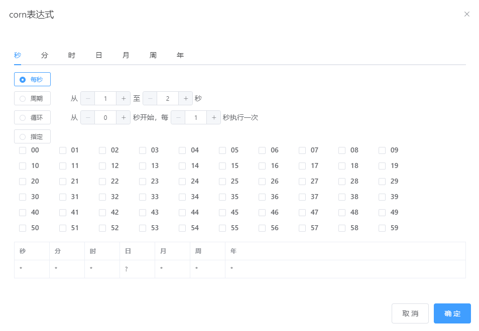

## 前言

最近要做一个爬虫管理页面，爬虫任务需要周期性触发，需要输入```cron```表达式，这是我第二次遇到需要输入```cron```表达式的需求，由于很多产品、测试或发布任务的操作人员不了解```cron```表达式，最好的办法就是将```cron```表达式呈现为可视化操作页面

## cron表达式

```cron```表达式是一个由空格符隔开的6-7域组成，通常用来执行一些周期性任务，有一下两种格式：

* Seconds Minutes Hours DayofMonth Month DayofWeek Year
* Seconds Minutes Hours DayofMonth Month DayofWeek

字段：

|       字段       |       值       |    特殊字符    |
|------------------|----------------|----------------|
|      Seconds           |           0~59的整数      |  , - * /  |
|      Minutes           |           0~59的整数      |  , - * /  |
|      Hours             |           0~23的整数      |  , - * /  |
|      DayofMonth(日期)  |   1~31的整数（需要考虑你月的天数）   |  ,- * ? / L W C  |
|      Month             |   1~12的整数或者 JAN-DEC            |  , - * /  |
|      DayofWeek(星期)   |   1~7的整数或者 SUN-SAT （1=SUN）   |   , - * ? / L C #  |
|      Year(选填)        |          1970~2099        |  , - * /  |

特殊字符：

* *表示任意值
* , 表示枚举
* -表示范围
* / 表示开始时间及间隔多久触发一次
* ? 表示不指定，只能用在```DayofMonth```和```DayofWeek```，由于两者互相影响一般定义其中一个时另一个为?
* L 表示最后，只能用在```DayofMonth```和```DayofWeek```，在```DayofMonth```则表示当月最后一天，在```DayofWeek```L则表示当月最后一个星期天，以此类推5L表示最后一个星期4
* W 表示最近的有效工作日(周一至周五)，只能出现在```DayofMonth```，不会跨月份寻找最近工作日。如： 15W(指的是最接近15号的工作日)，如果15号为周六则14号触发，如果15号为周日则16号触发，如果15号为周一，则15号触发。
* LW 这两个字符可以连用，表示在某个月最后一个工作日，即最后一个星期五
* #表示第几个星期的星期几，只能出现在```DayofWeek```。 例如在5#3，表示当月的第3个星期4

## cron 可视化

[体验地址](https://chasejourney.top/vuecron/#/)
[github](https://github.com/xwei111/vuecron)

上述基本就是```cron```表达式的配置规则，只有```DayofMonth```和```DayofWeek```规则略微不同，其余域的规则几乎相同，了解了规则就可以开发一个```cron```表达式的操作界面了，这里有两个版本的(element网上基本有了，拿过来稍加改动了一下)：

```Ant Design of Vue```版：


```Element ui```版：



## 结语

忙起来就没时间写，还是要坚持的！！！


