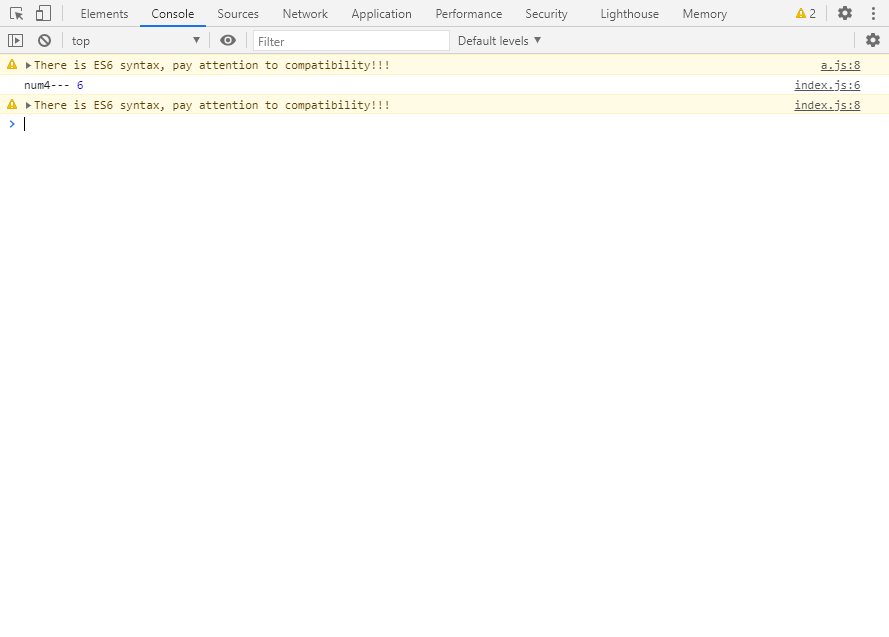

## 前言

webpack在前端工程化进程中扮演着及其重要的角色，不仅日常开发中会使用，而且前端框架、ui库及各个插件几乎都用到了webpack，所以了解webpack的一些基本原理还是很重要的。

## 搭建一个demo

* 初始化

```js
npm init
// package.json
"scripts": {
    "build": "webpack"
}
```

* 安装webpack相关依赖

```js
npm install webpack webpack-cli --save-dev
```

* 新建index.html

```html
<!DOCTYPE html>
<html lang="en">
<head>
    <meta charset="UTF-8">
    <title>Webpack</title>
</head>
<body>
<!-- 打包后的bundle.js -->
<script src="./dist/bundle.js"></script>
</body>
</html>

```

* 新建src文件夹，在src下添加index.js、a.js、b.js、c.js

```js
// c.js
module.exports = { num3: 3 }
// b.js
module.exports = { num2: 2 }
// a.js
const { num2 } = require('./b.js')
module.exports = { num1: 1, num2 }
// index.js
const { num1, num2 } = require('./a.js');
const { num3 } = require('./c.js');
const num4 = num1 + num2 + num3;
console.log('num4---', num4)
```

* 新建webpack.config.js
```js
const path = require('path');

module.exports = {
    mode: 'development',
    entry: "./src/index.js",
    output: {
        path: path.resolve(__dirname,  './dist'),
        filename: "bundle.js"
    }
};
```

基本工作已经完成了，执行```npm run build```打包

## bundle.js

打包后我们打开```index.html``` F12可以看到控制台打印出```num4--- 6```，说明我们打包成功了。

接下来我们来分析一下```dist/bundle.js```，将多余代码删除，整理后得到了如下代码：

```js
// 将整个解析出来的模块即modules传入自执行函数，key即路径，value即执行代码
(function (modules) {
    // 用来存储解析过的模块
    var installedModules = {}; 
    // moduleId即为各个模块的唯一标识
    function __webpack_require__(moduleId) {
        // 解析过的模块直接返回exports
        if (installedModules[moduleId]) {
            return installedModules[moduleId].exports;
        }
        // 定义module，包含唯一标识i和exports
        var module = installedModules[moduleId] = {
            i: moduleId,
            exports: {}
        };
        // 调用modules[moduleId]对应的函数
        // 会执行eval中的代码
        // eval中遇到module.exports时，module代表call传入的第二个参数module，exports代表call传入的第三个参数module.exports
        // eval中遇到__webpack_require__则调用call的四个参数__webpack_require__函数，以此形成递归
        modules[moduleId].call(module.exports, module, module.exports, __webpack_require__);
        // 返回exports
        return module.exports;
    }
    // 初次调用，传入webpack.config.js中的entry，我们的配置是./src/index.js
    return __webpack_require__("./src/index.js");
})
({
"./src/a.js":
    (function (module, exports, __webpack_require__) {
        eval("const { num2 } = __webpack_require__(\"./src/b.js\")\r\n\r\nmodule.exports = {\r\n    num1: 1,\r\n    num2\r\n}\n\n//# sourceURL=webpack:///./src/a.js?");
    }),
"./src/b.js":
    (function (module, exports) {
        eval("module.exports = {\r\n    num2: 2\r\n}\n\n//# sourceURL=webpack:///./src/b.js?");
    }),

"./src/c.js":
    (function (module, exports) {
        eval("module.exports = {\r\n    num3: 3\r\n}\n\n//# sourceURL=webpack:///./src/c.js?");
    }),
"./src/index.js":
    (function (module, exports, __webpack_require__) {
        eval("const { num1, num2 } = __webpack_require__(\"./src/a.js\");\r\nconst { num3 } = __webpack_require__(\"./src/c.js\");\r\n\r\nconst num4 = num1 + num2 + num3;\r\n\r\nconsole.log('num4---', num4)\n\n//# sourceURL=webpack:///./src/index.js?");
    })
});
```

从上述代码中我们可以了解到：

1. 打包后得到一个自执行函数，解析后的模块以参数形式传入
2. 模块有唯一标识，各个模块将被解析为键值对形式，键为模块路径，值为模块内部代码
3. 所有解析过的模块都将被缓存起来
4. 自定义```module```、```exports```、```__webpack_require__```等处理无法解析的```module.exports```、```require```
5. 初次调用```__webpack_require__```从配置的```entry```入口开始
6. 模块解析出的代码中的```__webpack_require__```实则为通过call传入的```__webpack_require__```方法，以达到递归调用```__webpack_require__```

基本看完上述代码和分析就能够了解到```webpack```是如何运作的了

## 模块解析

我们已经了解了```webpack```如何让各个模块运作起来了，但是```webpack```又是如何解析各个模块的呢？？？```webpack```本身就是```node```应用，自然会用到```node```的一些模块，读取模块内容可以使用```node```的```fs```模块，我们可以创建一个```analysis.js```来尝试一下解析模块

```js
const fs = require('fs');

const getModules = (file) => {
    const body = fs.readFileSync(file, 'utf-8')
    console.log(body)
}

getModules('./src/index.js')
```

```node analysis.js```执行看一下结果：

```
const { num1, num2 } = require('./a.js');
const { num3 } = require('./c.js');

const num4 = num1 + num2 + num3;

console.log('num4---', num4)
```

ok，已经可以完全拿到```index.js```的内容了，但这个我们用不了，还需要继续解析，这时就要用[@babel/parser](https://www.javascriptc.com/docs/babel-manual/babel-parser)将我们拿到的内容解析成```AST```，然后用[@babel/traverse](https://babeljs.io/docs/en/babel-types#callexpression)遍历```AST```替换掉```require```并拿到各个模块的路径，安装```@babel/parser```和```@babel/traverse```

```
cnpm install @babel/parser
cnpm install @babel/traverse
```

此时代码变成这个样子：

```js
const fs = require('fs');
const path = require('path');
const parser = require('@babel/parser');
const traverse = require('@babel/traverse').default;

const getModules = (file) => {
  const body = fs.readFileSync(file, 'utf-8')
  const ast = parser.parse(body);
  const deps = []
  traverse(ast, {
    // 对语法树中特定的节点进行操作
    CallExpression(p) {
      if (p.node.callee.name === 'require') {
        // require无法解析，将代码中的require替换为自定义的__webpack_require__
        p.node.callee.name = '__webpack_require__'
        // 拿到各模块路径
        const dirname = path.dirname(file)
        const oldValue = p.node.arguments[0].value
        p.node.arguments[0].value = ('./' + path.join(dirname, oldValue)).replace(/\\+/g, '/')
        // 将require的路径添加到deps
        deps.push(p.node.arguments[0].value)
      }
    }
  })
  console.log('deps', deps)
}

getModules('./src/index.js')
```

```node analysis.js```执行看一下结果：

```
deps [ './src/a.js', './src/c.js' ]
deps [ './src/b.js' ]
deps []
deps []
```

到这里已经拿到了各个模块的真实路径，之后要做的就是遍历```deps```递归```getModules```方法将各个模块处理成键值对形式，键即为模块路径，值即为模块代码，路径我们已经得到了，怎么拿去模块代码呢？可以使用[@babel/generator](https://babeljs.io/docs/en/babel-generator)获得模块代码，安装```@babel/generator```并修改代码：

```js
// 安装@babel/generator
cnpm install @babel/generator

// 修改后代码
const fs = require('fs');
const path = require('path');
const parser = require('@babel/parser');
const traverse = require('@babel/traverse').default;
const generator = require('@babel/generator').default;
// 用来存储各个模块
const moduleInfo = {}

const getModules = (file) => {
    const body = fs.readFileSync(file, 'utf-8')
    const ast = parser.parse(body);
    const deps = []
    traverse(ast, {
        // 对语法树中特定的节点进行操作
        CallExpression(p) {
          if (p.node.callee.name === 'require') {
              // 将代码中的require替换为__webpack_require__
              p.node.callee.name = '__webpack_require__'
              // 拿到各模块路径并添加的deps中
              const dirname = path.dirname(file)
              const oldValue = p.node.arguments[0].value
              p.node.arguments[0].value = ('./' + path.join(dirname, oldValue)).replace(/\\+/g, '/')
              deps.push(p.node.arguments[0].value)
          }
        }
    })
    if (deps.length) {
        deps.map(dep => getModules(dep))
    }
    // 将moduleInfo处理成bundle.js中传入自执行函数的参数形式
    moduleInfo[file] = `(function (module, exports, __webpack_require__) {${generator(ast).code}})`
}

getModules('./src/index.js')

console.log('moduleInfo', moduleInfo)
```

```node analysis.js```执行再来看结果：

```
moduleInfo { 
    './src/b.js': '(function (module, exports, __webpack_require__) {module.exports = {\n  num2
: 2\n};})',
  './src/a.js': '(function (module, exports, __webpack_require__) {const {\n  num2\n} = __web
pack_require__("./src/b.js");\n\nmodule.exports = {\n  num1: 1,\n  num2\n};})',
  './src/c.js': '(function (module, exports, __webpack_require__) {module.exports = {\n  num3
: 3\n};})',
  './src/index.js': '(function (module, exports, __webpack_require__) {const {\n  num1,\n  num2\n
} = __webpack_require__("./src/a.js");\n\nconst {\n  num3\n} = __webpack_require__("./src/c.js"); \n\nconst num4 = num1 + num2 + num3;\nconsole.log(\'num4---\', num4);})' }
```

ok至此已经解析完了各个模块，并处理成了我们想要的数据格式！

## 生成bundle.js

定义一个```getBundle```函数来生成我们想要的```bundle.js```代码，同样利用```fs```模块将代码写入```bundle.js```，如下：

```js
const getBundle = () => {
    let str = '';
    // 遍历moduleInfo生成我们想要的字符串
    Object.keys(moduleInfo).map(key => {
        str += '"' + key + '"' + `: ${moduleInfo[key]},`
    })
    str = "{" + str + "}"
    // 自执行函数可以直接copy利用，但传入的参数要是我们实际生成的数据
    return `(function (modules) {
                var installedModules = {}; 
                function __webpack_require__(moduleId) {
                if (installedModules[moduleId]) {
                    return installedModules[moduleId].exports;
                }
                var module = installedModules[moduleId] = {
                    i: moduleId,
                    exports: {}
                };
                modules[moduleId].call(module.exports, module, module.exports, __webpack_require__);
                return module.exports;
            }
            return __webpack_require__("./src/index.js");
        })(${str})`
}

const content = getBundle()
// 自定义self文件夹
fs.mkdirSync('./self');
// 将代码写入self/bundle.js
fs.writeFileSync('./self/bundle.js', content)
```

再来执行```node analysis.js```会发现目录下生成了self/bundle.js文件，```bundle.js```代码如下(整理了一下便于观看)：

```js
(function (modules) {
  var installedModules = {};
  function __webpack_require__(moduleId) {
    if (installedModules[moduleId]) {
      return installedModules[moduleId].exports;
    }
    var module = installedModules[moduleId] = {
      i: moduleId,
      exports: {}
    };
    modules[moduleId].call(module.exports, module, module.exports, __webpack_require__);
    return module.exports;
  }
  return __webpack_require__("./src/index.js");
})({
  "./src/b.js": (function (module, exports, __webpack_require__) { 
    module.exports = { num2: 2 }; 
  }), 
  "./src/a.js": (function (module, exports, __webpack_require__) { 
    const { num2 } = __webpack_require__("./src/b.js"); module.exports = { num1: 1, num2 };
  }), 
  "./src/c.js": (function (module, exports, __webpack_require__) { 
    module.exports = { num3: 3 }; 
  }), 
  "./src/index.js": (function (module, exports, __webpack_require__) {
    const { num1, num2 } = __webpack_require__("./src/a.js");
    const { num3 } = __webpack_require__("./src/c.js");
    const num4 = num1 + num2 + num3;
    console.log('num4---', num4);
  }),
})
```

生成的```bundle.js```已经包含了主流程，将其引入```index.html``` F12可以看到控制台打印出```num4--- 6```，这表示我们打包的```bundle.js```是ok的，
从分析到手动生成```bundle.js```让我们对```webpack```打包原理有了更深入的理解

## loader

```webpack```本身只能解析```.js```后缀文件，解析其他文件则需要配置```loader```，如```.css```后缀需要用到```style-loader```和```css-loader```,```.vue```需要用到```vue-loader```，正是因为这些loader的存在```webpack```才能正常的解析文件，如果这些loader无法满足你的需求就需要自定义一个loader，我们来自定义一个警告的loader了解一下流程

新建```loader/warning.js```

```js
module.exports = function (source) {
    var warning = '';
    if(source.indexOf('const') > -1) {
        warning = "\n\rconsole.warn('存在es6语法，注意兼容性')"
    }
    return source + warning
}
```

配置```webpack.config.js```

```js
module: {
  rules: [
    {
      test: /\.js$/,
      use: ['./loader/warning.js']
    }
  ]
}
```

然后重新打包，打开```index.html```F12会看到如下提示：


如果要自定义loader的参数可以安装[loader-utils](https://github.com/webpack/loader-utils)，使用如下：

```js
// webpack.config.js
{
  test: /\.js$/,
  use: {
      loader: './loader/warning.js',
      options: {
          message: "There is ES6 syntax, pay attention to compatibility!!!"
      }
  }
}
// warning.js
const loaderUtils = require('loader-utils')

module.exports = function (source) {
    const options = loaderUtils.getOptions(this)
    var warning = '';
    console.log('options--', options)
    if(source.indexOf('const') > -1) {
        warning = "\n\r console.warn("+ '"'+ options.message + '"' +")"
    }
    return source + warning
}
```

重新打包，打开```index.html```F12会看到如下提示：



[代码](https://github.com/xwei111/webpack_principle_demo)


## 结语

webpack内容非常多，单是配置都要看很久，还有插件钩子函数等需要逐步去了解，积硅步,至千里！！！


