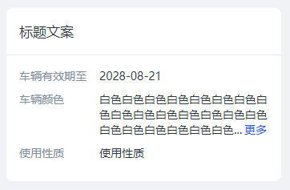

## 前言

最近又开始忙了，做个h5项目，发现了一个有意思的需求：内容超过三行显示...和```更多```，点击```更多```展开所有内容，大概如下效果（经过和设计师一番讨论后，设计师直接扔给下边这张图啪啪的打脸，后来想想移动端不像pc端可以有很多其他的方案如：pop、modal等展示多余内容，这样的需求也是合理的）：


这个小需求看起来蛮简单的好像没什么难度，但当我开始去做的时候一切都开始变得有意思了。

## 分析

这个需求大概有三个要点：

1. 内容超过三行显示...和```更多```
2. ...和```更多```的位置刚好在第三行末尾
3. 点击```更多```可以展开所有内容

## 尝试 css 实现

多数小伙伴应该和我一样第一想法就是使用css实现，因为css省时省力，大概代码如下：

```css
.box {
    overflow: hidden;
    text-overflow: ellipsis;
    display: -webkit-box;
    -webkit-line-clamp: 3;（行数）
    -webkit-box-orient: vertical;
}
```

ok，就是这么简单，...已经展示出来了，刚好在第三行末尾，接下来就看怎么放```更多```了。

半小时后....

ok，我知道css几乎不可能了，换思路继续

## 尝试 js 判断字符

css不行，尝试js，相信自己的直觉判断字符长度来实现：

1. 判断内容是否超过100字符（假如100字符+ ... + ```更多```在谷歌手机模式下刚好3行）
2. 超过100字符截取前100字符
3. 拼接字符串，得到前100字符 + ... + ```更多```

在浏览器手机模式下乍看还不错，到真机上一看不同手机上```更多```的位置完全不一样，果然还是不能盲目自信啊

接着我也想了一些很low的方案，自己写一个```<div>...更多</div>```然后定位到最后，但这样必然会有一些字体被盖住，非常的不自然，最后还是放弃了这样的想法，
ok，放平心态继续

## 最终方案

之前的尝试都失败了，但也不必气馁总会有答案的！```getClientRects```就是我们的答案，简单介绍一下```getClientRects```:

getClientRects()是获取元素占据页面的所有矩形区域，返回一个```TextRectangle```，```TextRectangle```是一个类数组，它是对文本区域的描述主要包含文本的位置信息，TextRectangle的长度即为文本的行数，需要注意的是```getClientRects```对于块级元素永远都只有一行，对于行内元素则返回你在页面看到行数，这点是非常重要的，因为我们要计算文本的行数需要用到行数这一数据，看一下相同数据不同标签getClientRects()方法获得的数据

```js
// div标签
DOMRectList {0: DOMRect, length: 1}

// span标签
DOMRectList {0: DOMRect, 1: DOMRect, 2: DOMRect, 3: DOMRect, 4: DOMRect, 5: DOMRect, 6: DOMRect, 7: DOMRect, 8: DOMRect, 9: DOMRect, 10: DOMRect, 11: DOMRect, 12: DOMRect, length: 13}
```

事实证明了我们如果要计算内容有多少行则需要使用行内标签，拿到行数后基本就可以正式开始我们的逻辑了（这里在提醒一下布局方面的知识，一般情况下行内标签可以放在一个块级元素中，由这个块级元素来决定整体的位置宽度等），项目是用```react```写的，虽然喜欢```vue```但也没必要再用```vue```撸一遍了，理解了逻辑自己写一个还是方便的，代码如下（附主要逻辑注释）：

```tsx
import React, { useEffect, useState, useRef } from 'react';

export default (props: any) => {
    const ref = useRef(null);
    const { text = '', line = 3 } = props;
    const [isMore, setIsMore] = useState<boolean>(false);

    useEffect(() => {
        // 异步处理项目中动态计算的label宽度导致的内容宽度变化
        setTimeout(() => {
            const dom: any = ref.current;
            // 初始化dom内容
            dom.innerHTML = text;
            let content = text;
            // 获得文本内容描述
            let TextRectangles = dom.getClientRects();
            // 获得文本真实行数
            let h = getLength(TextRectangles);
            if (h > line) {
                setIsMore(true);
            }
            // 当文本行数大于规定的行数时开始循环直到文本行数小于规定行数
            while (h > line) {
                var step = 1;
                // 遇到换行截取5个
                if (/<br \/>$/.test(content)) {
                    step = 5;
                }
                // 从尾部开始截取
                content = content.slice(0, -step);
                // 拼接...和更多
                dom.innerHTML =
                    content +
                    `<span>...</span><span style="color: #255BDA; margin-left: 3px;">更多</span>`;
                // 获取当前的行数并赋值给h
                h = getLength(dom.getClientRects());
            }
        }, 0)
    }, []);

    function getLength(TextRectangles: any) {
        var line = 0,
            lastBottom = 0;
        // 遍历文本，如果前后两个距离底部距离不同+1，获得真实行数
        for (var i = 0, len = TextRectangles.length; i < len; i++) {
            if (TextRectangles[i].bottom !== lastBottom) {
                lastBottom = TextRectangles[i].bottom;
                line++;
            }
        }
        return line;
    }
    // 点击更多是将所有内容赋值给文本
    const moreClick = () => {
        if (isMore) {
            (ref as any).current.innerHTML = text;
        }
    };

    return <span ref={ref} onClick={moreClick} />;
};

```


效果如下：




## 结语

遇到事情先逼一下自己，也许就不会有那么多的妥协了

