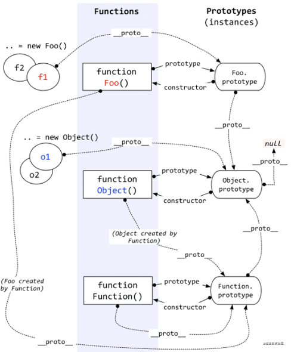

## 前言

网上看到一张图片，说是看懂了也就知道了原型、原型链了，我也按照图片的流程看了一下，还是能够为这句话正名的，我也想按照这个图片来解释一下原型和原型链



## 原型、原型链

在```js```中函数有一个```prototype```属性，这个```prototype```就是我们说的原型、原型对象，原型有一个隐藏属性```constructor```，这个隐藏属性指向关联的构造函数

那原型链是什么呢，在```js```中对象有一个```___proto__```属性，```___proto__```指向```prototype```，```prototype```本身也是一个对象，它也有```___proto__```，依次向上找会找到```Obj.prototype```，在向上找就是```null```了，按此查找形成的链条就是原型链，用下边的```demo```来解释这句话

```js
function Test() { }
Test.prototype.age = 18
Object.prototype.name = '老王'
const test = new Test()
console.log('test', test, test.age, test.name, test.sex)

// 打印结果： test Test {} 18 老王 undefined
// 解析: test.__proto__指向了Test.prototype，Test.prototype.__ptoto指向了Object.prototype
// 当查询test的age或name属性时，会先查询实例test自身是否存在，不存在则向test原型对象查找
// 若还是没有则向Obj.prototype查找，若还是找不到则为undefined
// 这样查找的链条则形成了原型链
```

## 解图

简单了解了原型，我们来用代码解释一下前言的图片

* 构造函数Foo

```js
function Foo() {}
// new函数我们上篇已经实现过了这里不重复实现
const f1 = new Foo()

// Foo作为函数具有prototype属性
// f1作为对象，构造函数为Foo，所以f1有一个__proto__指向Foo.prototype
console.log(f1.__proto__ === Foo.prototype) // true

// Foo.prototype作为对象，__proto__指向Object.prototype
console.log(Foo.prototype.__proto__ === Object.prototype) // true

// Foo.prototype有一个隐藏属性constructor，指向关联的构造函数，也就是Foo
console.log(Foo.prototype.constructor === Foo) // true

// Foo为函数，亦是对象，所以Foo也有__proto__属性，指向Function.prototype
console.log(Foo.__proto__ === Function.prototype) // true

// Function本身也是对象，也具有__proto__，指向了Function.prototype
console.log(Function.__proto__ === Function.prototype) // true

// Function.prototype的constructor属性指向了Function
console.log(Function.prototype.constructor === Function) // true

// Function.prototype最为对象具有__proto__属性，指向了Object.prototype
console.log(Function.prototype.__proto__ === Object.prototype) // true

// Object既为函数，亦是对象，__proto__指向Function.prototype
console.log(Object.__proto__ === Function.prototype) // true

// Object.prototype的隐藏属性constructor指向function Object()
console.log(Object.prototype.constructor === Object) // true

// 最终指向null
console.log(Object.prototype.__proto__) // null

// 至此，构造函数Foo这条链路基本已经分析完毕
```

* 普通对象o1

```js
const o1 = new Object()
console.log(o1.__proto__ === Object.prototype) // true
```

* 总结

1. ```__proto__```指向```prototype```
2. 函数对象（即函数）```__ptoto```指向```Function.prototype```，```Function```、```Object```均是函数
3. 原型链最终会找到```Object.prototype```，最终为null

## Object、Function轮回

图解虽然完了，但是```Object```、```Function```这块还是有些蒙蔽的，鸡生蛋蛋生鸡的，如果非要解释它们的关系，个人认为可以从```Object.prototype```分析：

1. 世界起初一片混沌，也就是```null```
2. ```Object.prototype```作为上帝创造的最先出生
3. ```Function.prototype```继承```Object.prototype```而生
4. ```Object```、```Function```、```String```等继承```Function.prototype```而生

代码看一下：

```js
// 第一、二步
// Object.prototype没有原型对象
console.log(Object.prototype.__proto__) // null
// 第三步
console.log(Function.prototype.__proto__ === Object.prototype) // true
// 第四步
console.log(Object.__proto__ === Function.prototype) // true
console.log(Function.__proto__ === Function.prototype) // true
console.log(String.__proto__ === Function.prototype) // true
console.log(Array.__proto__ === Function.prototype) // true

```
这样的回答并不足以解释所有的问题，但还算是一个比较容易让人理解的回答

## 万物皆对象

用接下来的代码来证明这句话

```js
const str1 = 'a';
const str2 = new String('a')
console.log('str1', str1.__proto__ === String.prototype) //true
console.log('str2', str2.__proto__ === String.prototype) //true
console.log(String.prototype.__proto__ === Object.prototype) //true

const num1 = 1;
const num2 = new Number(1)
console.log('num1', num1.__proto__ === Number.prototype) //true
console.log('num2', num2.__proto__ === Number.prototype) //true
console.log(Number.prototype.__proto__ === Object.prototype) //true

const bool1 = true;
const bool2 = new Boolean(true)
console.log('bool1', bool1.__proto__ === Boolean.prototype) //true
console.log('bool2', bool2.__proto__ === Boolean.prototype) //true
console.log(Boolean.prototype.__proto__ === Object.prototype) //true

const reg1 = new RegExp();
const reg2 = /1/;
console.log('reg1', reg1.__proto__ == RegExp.prototype) //true
console.log('reg2', reg2.__proto__ == RegExp.prototype) //true
console.log(RegExp.prototype.__proto__ === Object.prototype) //true

const arr = [];
console.log(arr.__proto__ === Array.prototype); //true       
console.log(Array.prototype.__proto__ === Object.prototype); //true

const date = new Date();
console.log(date.__proto__ === Date.prototype); //true
console.log(Date.prototype.__proto__ === Object.prototype); //true

// 还有函数，这里看一下箭头函数，箭头函数虽没有prototype，但仍是对象
const fn = () => { }
console.log(fn.prototype) // undefined
console.log(fn.__proto__ == Function.prototype) // true
```

## 结语

这里没有做过多总结，希望每个人都有自己的理解


